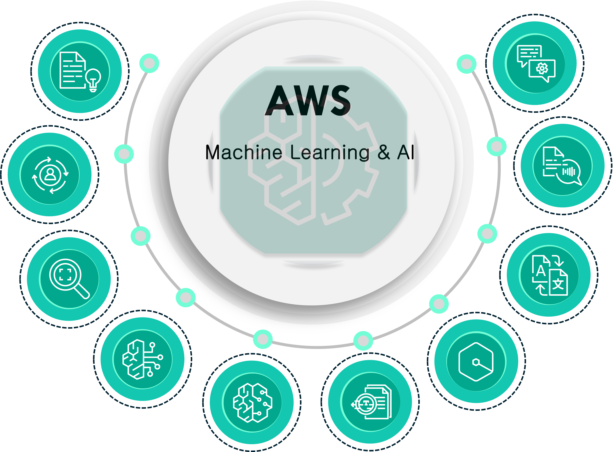

# Machine Learning & AI Services: Exploring Alternatives and Differences Between AWS and Azure

## Introduction
As cloud-based machine learning (ML) and artificial intelligence (AI) services continue to expand, Azure and AWS lead the pack with powerful, flexible tools for building intelligent applications. Whether you're a data scientist, machine learning engineer, or developer, understanding how these two giants compare is critical for selecting the right platform. 

|  |  |
|------------------------|------------------------|
| Common AWS ML and AI Services   | Common Azure ML and AI Services    |

Here is a brief comparison of Azure and AWS Machine Learning and AI services, including alternative offerings and exclusive tools available on each platform. The services are presented side by side so you can see where each provider excels, and highlight features unique to Azure or AWS.

## Comparison Table: AWS vs. Azure Machine Learning & AI Services

| **Service**                  | **AWS**                                     | **Azure**                                       | **Service Description**                                                                                             |
|------------------------------|---------------------------------------------|-------------------------------------------------|---------------------------------------------------------------------------------------------------------------------|
| Integrated ML Platform       | Amazon SageMaker                           | Azure Machine Learning                          | End-to-end machine learning platform for building, training, and deploying models. Includes Studio, Designer, and Notebooks for a unified ML environment. |
| Automated ML (AutoML)        | SageMaker Autopilot                        | Azure ML Automated ML                           | Automates model selection, feature engineering, and hyperparameter tuning for non-experts.                          |
| Data Labeling                | SageMaker Ground Truth                     | No direct equivalent                            | Automated data labeling for creating training datasets.                                                             |
| Pre-Built AI Models          | Rekognition, Polly, Textract               | Azure Cognitive Services                        | Pre-trained models for vision, text, speech, and decision-making tasks. Azure also offers models for document intelligence and generative AI.            |
| Natural Language Processing  | Amazon Comprehend, Lex, Translate          | Azure AI Language, LUIS, Translator             | NLP services including language detection, translation, text analysis, and conversational AI for building chatbots and digital assistants.               |
| Speech Services              | Amazon Polly, Transcribe, Translate        | Azure AI Speech                                 | Speech-to-text, text-to-speech, and real-time speech translation. Azure also offers speaker recognition.            |
| Computer Vision              | Amazon Rekognition                         | Azure Computer Vision, Custom Vision, AI Vision | Image and video analysis with facial recognition, object detection, OCR, and semantic segmentation capabilities.    |
| Document Processing          | Amazon Textract                            | Azure AI Document Intelligence                  | Extracts text, tables, and key-value pairs from documents. Azure offers prebuilt and custom models for various document types.                           |
| Recommendation Systems       | Amazon Personalize                         | Azure Personalizer                              | AI-based recommendation services for personalized content and product suggestions. Azure uses reinforcement learning for real-time personalization.      |
| Search                       | Amazon Kendra                              | Azure Cognitive Search                          | AI-powered search services with NLP support for enterprise search. Azure Search includes AI enrichment and integration with other Azure AI capabilities. |
| Bot Development              | Amazon Lex                                 | Azure Bot Service                               | Tools for building, deploying, and managing chatbots. Azure Bot Service integrates with other Azure AI services like LUIS for enhanced conversational AI. |
| Edge AI and ML               | AWS Panorama, IoT Greengrass               | Azure IoT Edge, Azure Percept                   | AI capabilities at the edge for real-time inference. Azure integrates seamlessly with Azure AI Vision for advanced analytics at the edge.                |
| Quantum Machine Learning     | Amazon Braket                              | Azure Quantum                                   | Quantum computing platforms with integrations for machine learning experiments.                                    |
| Generative AI Services       | AWS Bedrock, Amazon Q for Developer        | Azure OpenAI Service                            | Services providing generative AI and language models. Azure integrates GPT models for advanced NLP and generative tasks.                                |
| AI Development Environment   | AWS Playground                             | Azure AI Studio                                 | Interactive environments for experimenting with different AI and ML services, managing projects, and deploying AI solutions.                            |
| Responsible AI               | No direct equivalent                       | Responsible AI Services                         | Azure offers tools and frameworks to ensure fairness, transparency, and accountability in AI solutions, focusing on ethical AI development.              |

## Exclusive Services: AWS
1. **SageMaker Ground Truth**: Automated data labeling.
2. **Fraud Detector**: AI-powered fraud detection service.
3. **Amazon CodeGuru**: AI-driven code reviews and performance improvement.
4. **AWS Panorama**: Real-time computer vision at the edge.
5. **AWS HealthLake**: AI-powered, HIPAA-compliant healthcare data lake.
6. **AWS Trainium**: Custom-built ML training chip for deep learning workloads.
7. **AWS Bedrock**: Managed generative AI for building language and image-based applications.
8. **Amazon Q for Developer & Business**: AI toolkit for building applications and providing AI-powered business insights.

## Exclusive Services: Azure
1. **Azure Personalizer**: Reinforcement learning-based real-time personalization.
2. **Azure Arc-enabled ML**: Extends Azure ML capabilities to hybrid and multi-cloud environments.
3. **Speaker Recognition**: Identifies and verifies speakers in audio data.
4. **Azure AI Document Intelligence**: Advanced document processing with prebuilt and custom models for invoices, health records, etc.
5. **Azure AI Studio**: Unified development environment for managing AI projects, integrating various Azure AI services, and creating generative AI solutions.
6. **Responsible AI Services**: Built-in tools to ensure responsible and ethical AI development, focusing on fairness, privacy, and transparency.
7. **Azure AI Knowledge Mining**: Extracts information from unstructured data, creating searchable knowledge stores.
8. **Azure OpenAI Service**: Access to OpenAI's cutting-edge models for text and image generation.

## Conclusion
Azure and AWS both offer a robust suite of machine learning and AI services, with overlapping features and distinct advantages. **Azure's** strength lies in its **integration with enterprise services**, a focus on **responsible AI**, and advanced tools like **Azure AI Document Intelligence** and **Knowledge Mining**. **AWS**, on the other hand, excels with specialized offerings like **Fraud Detector**, **CodeGuru**, and **Bedrock** for generative AI.

Choosing between Azure and AWS ultimately depends on your needs. If your focus is on **hybrid cloud capabilities**, **responsible AI**, and **seamless integration** with other Microsoft services, Azure is an excellent choice. If you need **niche AI tools**, **edge computing**, or **advanced generative AI capabilities**, AWS may be better suited.

Whichever platform you choose, both Azure and AWS provide the flexibility and power needed to innovate with machine learning and AI, supporting businesses and developers in building intelligent, efficient, and impactful applications.

## Learn More
For more information on AWS Machine Learning and AI Services, visit the [AWS Documentation on Machine Learning](https://docs.aws.amazon.com/machine-learning/). You can also explore learning resources on AWS Skill Builder for the [AWS Certified AI Practitioner](https://aws.amazon.com/certification/certified-ai-practitioner/?gclid=Cj0KCQjwmOm3BhC8ARIsAOSbapVW7tJJX7QuxsS0lhSUnlC6i918DOCR8dk40LAEJnYDdMk5xFUG9ycaAnu9EALw_wcB&trk=76a09922-9ba6-48ef-8745-876a0e43d2d2&sc_channel=ps&ef_id=Cj0KCQjwmOm3BhC8ARIsAOSbapVW7tJJX7QuxsS0lhSUnlC6i918DOCR8dk40LAEJnYDdMk5xFUG9ycaAnu9EALw_wcB:G:s&s_kwcid=AL!4422!3!709243719044!e!!g!!aws%20artificial%20intelligence%20training!21582272861!166844408780&gbraid=0AAAAADjHtp_m-HVeJhdh57pGV7eZ270WJ).

For Azure, you can find more information on [Azure AI Services](https://azure.microsoft.com/en-us/products/ai-services) and explore learning resources for [Azure AI Fundamentals](https://learn.microsoft.com/en-us/credentials/certifications/azure-ai-fundamentals/?ns-enrollment-type=Collection&ns-enrollment-id=w31fowm0dn4mz&practice-assessment-type=certification).

## Disclaimer
The information provided in this post is based on publicly available information as of [October 2024]. The features, capabilities, and offerings of AWS and Azure machine learning and AI services may change over time. This post is intended for informational purposes only, and readers are encouraged to verify the information directly from official AWS and Azure documentation before making any decisions. The views expressed here are my own and do not represent any company or organization.
